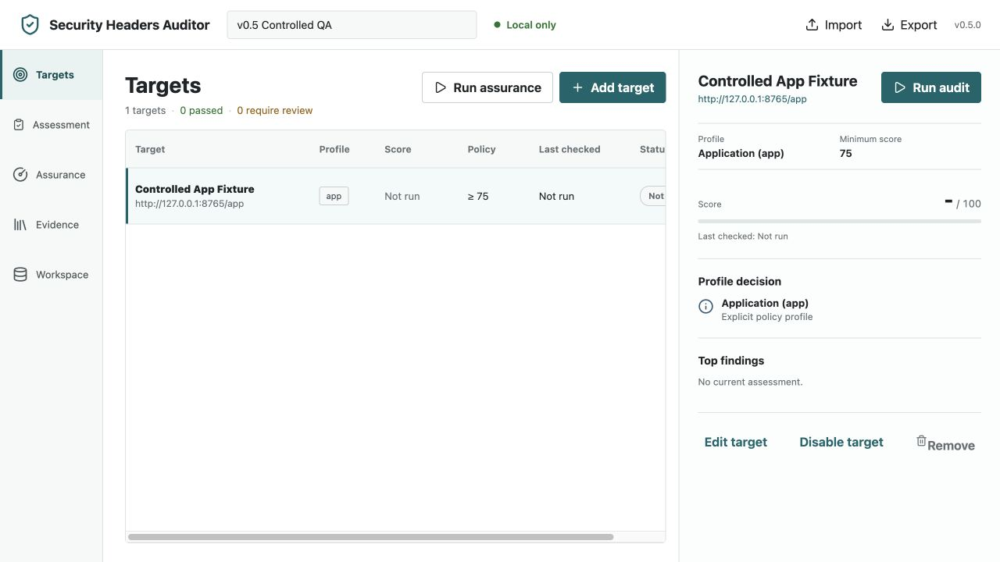
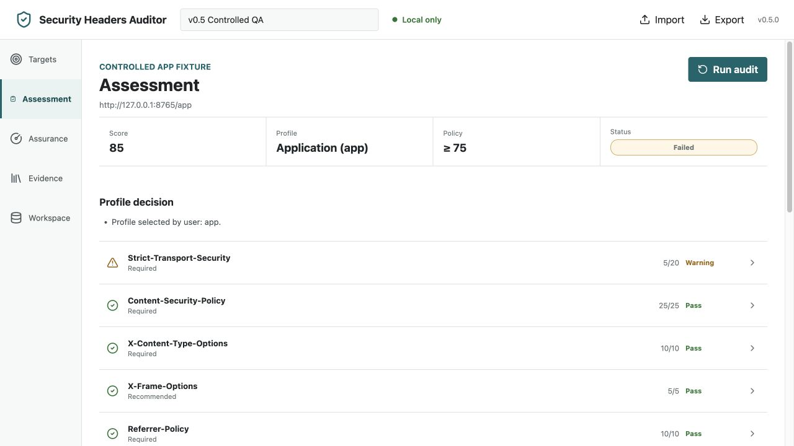
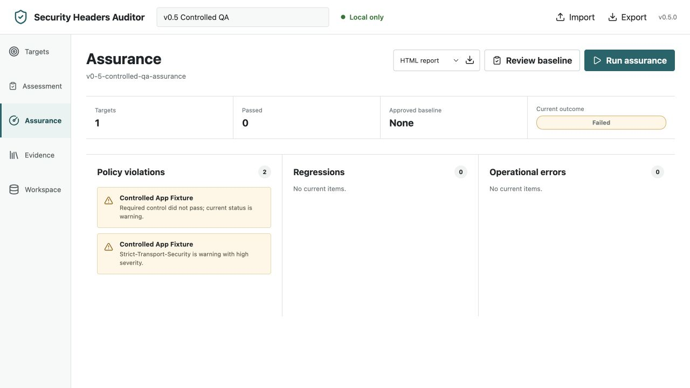

# v0.5 Local Workspace Tutorial

This tutorial uses only targets that you own, administer, or are explicitly
authorized to assess. The workspace is a local interface to the same audit and
assurance engine used by the CLI; it is not a hosted scanner and does not crawl
or discover routes.

## 1. Start A Local Session

Install the package, then start the workspace:

```bash
security-headers-auditor workspace
```

The process binds only to `127.0.0.1` and opens the browser page. It prints the
local origin but never prints the memory-only session token. Stop it with
`Ctrl+C` when the review is finished.

The default session permits public targets only. For a controlled internal test
or private service, use this explicit, session-scoped exception:

```bash
security-headers-auditor workspace --allow-private-targets
```

Do not use that option outside an authorized scope.



## 2. Create A Narrow Authorized Inventory

Create a workspace, then add one target at a time. Give each target a stable,
human-recognizable label and select its known response profile:

- **Application** for authenticated or stateful HTML responses;
- **API response** for JSON, GraphQL, or XML responses;
- **Public brochure** for limited-state public HTML.

Set only expectations that fit the response. A minimum score, required controls,
reporting-readiness expectation, and cross-origin-isolation expectation are
evaluated through the existing policy engine. Disabling a target prevents both
single assessment and aggregate assurance runs and clears its latest stored
summary.

The workspace stores policy configuration, approved baselines, and summarized
outcomes locally. Detailed response values stay in the current browser session
until replaced or explicitly exported.

## 3. Run And Interpret An Assessment

Choose **Run** from the target inventory. The assessment view shows the selected
profile, score, controls, explicit evidence, recommendations, and limits. A
finding is evidence about the observed response; it is not proof that the whole
application is secure.

Use the **Evidence** view to inspect OWASP, NIST, ATT&CK, and D3FEND
relationships. These are labelled with their relationship type, confidence, and
limitations. They support engineering review and do not certify compliance.



## 4. Run Assurance And Approve A Baseline Deliberately

Choose **Run assurance** to evaluate all enabled targets against the workspace
policy. The resulting view separates policy violations, regressions, and
operational errors; a failure is never displayed as a pass.

After a successful run, choose **Review baseline**. Read the target-by-target
diff, tick the explicit approval control, and select **Approve baseline** only
when the candidate is intended. Later assurance runs detect score, profile, and
control-state regressions against that approved state.



## 5. Export, Import, And Clear Local Data

- The report control can export the current in-memory result as HTML, Markdown,
  JSON evidence, SARIF 2.1.0, or JUnit XML where applicable.
- **Export JSON** writes the canonical workspace document. It is portable data,
  not an audit trigger.
- **Import JSON** validates a bounded document, previews its target count and
  migrations, and requires an explicit confirmation before creating or
  replacing local state. It never runs targets automatically.
- **Delete workspace** removes that workspace only after a deliberate action.

Protect exported reports and workspace JSON: they can identify authorized
systems, policies, scores, and control states. Query strings and fragments are
redacted by default; raw header values are not stored in workspace summaries.

## Boundaries

The workspace does not authenticate, crawl, fuzz, exploit, bypass controls,
schedule remote jobs, sync to the cloud, or provide a compliance decision. See
the [v0.5 methodology](V0.5_METHODOLOGY_SPECIFICATION.md),
[privacy and authorization guide](PRIVACY_ACCESSIBILITY_AUTHORIZATION.md), and
[browser QA record](QA_V0.5_WORKSPACE.md) for the verified operating limits.
