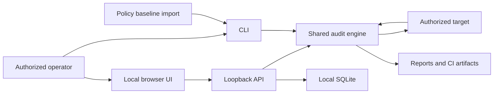

# Security Headers Auditor Threat Model

**Status:** v0.5 implementation baseline
**Reviewed:** 2026-07-19
**Repository branch:** `main`

## Executive summary

Security Headers Auditor is currently a local Python CLI that makes narrowly
bounded HTTP requests and renders untrusted response evidence into reports.
Version 0.5 adds a loopback-only workspace around the same evaluator. The
highest-risk areas are unauthorized use of the localhost audit API, server-side
request forgery into private or link-local services, unsafe rendering of hostile
header values, and loss or silent weakening of policies and baselines during
persistence or migration. The design therefore requires a memory-only session
token, strict same-origin API checks, no automatic execution of imported
targets, atomic versioned persistence, and continued escaping and redaction.

## Scope and assumptions

In scope:

- Python audit, assurance, report, and CLI modules under
  `src/security_headers_auditor/`;
- loopback runtime and workspace UI described in
  `docs/adr/0001-loopback-workspace-runtime.md`;
- SQLite persistence and import/export described in
  `docs/adr/0002-workspace-persistence-and-migrations.md`;
- policy, baseline, report, and future workspace JSON inputs;
- packaged frontend assets, build workflow, and release artifacts;
- local single-user execution on a normal workstation.

Assumptions:

- the workspace binds only to `127.0.0.1`;
- the user opens it on a device and browser profile they control;
- no remote accounts, teams, RBAC, synchronization, or hosted scanner exists;
- target URLs and policies may be attacker influenced until reviewed;
- header values and error strings are untrusted;
- private-network targets can be legitimate, so they require explicit operator
  intent rather than a universal prohibition;
- detailed reports and CI artifacts can contain sensitive security evidence.

Out of scope:

- compromise of the operating system, Python runtime, or browser itself;
- malicious extensions with permission to read page contents;
- security of third-party CI, artifact, or source-hosting platforms;
- authenticated crawling, exploit testing, and credential storage;
- protection from an attacker who already controls the user's account and local
  application-data directory.

Open questions that can change risk ranking:

- whether a future release will allow non-loopback binding;
- whether authenticated requests or custom headers will ever be supported;
- whether detailed historical reports will ever be persisted.

Any affirmative answer requires a new threat-model review.

## System model

### Primary components

- **CLI entry point:** parses explicit target, policy, baseline, and output
  arguments in `src/security_headers_auditor/cli.py`.
- **HTTP fetch boundary:** normalizes targets, blocks credential-bearing URLs,
  controls redirects, and performs HEAD/GET in
  `src/security_headers_auditor/auditor.py`.
- **Audit domain:** selects a response profile and evaluates headers in
  `auditor.py`, `profiles.py`, `catalog.py`, and `assurance_controls.py`.
- **Assurance domain:** validates policy and baseline documents and evaluates
  regressions in `assurance.py`.
- **Renderers:** generate escaped JSON, Markdown, HTML, SARIF, and JUnit output
  in `report.py` and `ci_report.py`.
- **Framework data:** loads packaged, versioned relationship data through
  `compliance.py`.
- **Loopback workspace:** serves bundled UI assets and a token-protected
  local JSON API, as constrained by ADR 0001.
- **Workspace persistence:** stores canonical workspace documents and minimal
  summaries in SQLite, as constrained by ADR 0002.

### Data flows and trust boundaries

- Operator -> CLI parser: URLs, paths, flags, and policy choices cross the shell
  boundary. `argparse`, strict JSON validation, and target normalization apply.
- CLI or workspace API -> Target origin: HTTP(S) HEAD and bounded GET fallback
  cross the network boundary. Redirect scope and timeouts apply; target content
  is not crawled.
- Target origin -> Audit engine: status, final URL, and response headers cross
  an untrusted network boundary. Values are normalized, parsed, and evaluated.
- Audit engine -> Renderers: structured findings cross an internal trust
  boundary. Renderers must continue treating every evidence string as
  untrusted.
- Policy or baseline file -> Assurance engine: strict JSON crosses a local-file
  boundary. Unknown fields and incompatible versions are rejected.
- Browser -> loopback API: target commands and workspace changes cross
  a localhost web boundary. Session token, same-origin, Fetch Metadata, content
  type, and size checks are enforced.
- Loopback API -> SQLite: canonical workspace state crosses a local persistence
  boundary. Schema validation, optimistic revision, and atomic transactions are
  enforced.
- Renderers -> Report or CI artifact: security evidence crosses an export
  boundary controlled by the operator or CI platform. Redaction and explicit
  retention controls apply.

#### Diagram

## Assets and security objectives

| Asset | Why it matters | Security objective |
| --- | --- | --- |
| Authorized target scope | Prevents the tool from reaching systems outside approved assessment boundaries | Integrity |
| Session token | Authorizes localhost audit and state-changing requests | Confidentiality, integrity |
| Policy and thresholds | Define what CI and the workspace treat as acceptable | Integrity, availability |
| Approved baseline | Represents an explicitly reviewed security-header state | Integrity, availability |
| Workspace database | Contains target inventory, posture summaries, and framework choices | Confidentiality, integrity, availability |
| Raw response headers in memory | May expose internal hosts, software, reporting endpoints, or identifiers | Confidentiality, integrity |
| Generated reports and CI artifacts | Can reveal target and security-posture information | Confidentiality, integrity |
| Audit methodology and framework mappings | Determine scores, findings, and interpretation | Integrity |
| Packaged frontend and Python release | Executes with the local user's network access | Integrity |

## Attacker model

### Capabilities

- Operates a malicious website open in the user's browser and can attempt
  cross-origin requests to localhost.
- Controls an audited web response, including status, redirects, and hostile or
  oversized header values.
- Supplies or modifies a workspace, policy, or baseline JSON file before the
  user imports it.
- Can influence DNS responses for an attacker-controlled hostname.
- Can contribute a compromised dependency or tamper with a build artifact if
  release controls fail.
- May share the same unlocked workstation or browser profile without having
  administrative operating-system access.

### Non-capabilities

- Cannot read the random session token from a different web origin under normal
  browser isolation.
- Cannot bypass operating-system file permissions without a separate local
  compromise.
- Cannot force the current CLI to crawl, authenticate, or execute response
  bodies.
- Cannot cause an imported workspace to run targets automatically when the
  v0.5 invariant is enforced.
- Does not control trusted primary-source framework data committed and reviewed
  in the release unless the repository or build chain is compromised.

## Entry points and attack surfaces

| Surface | How reached | Trust boundary | Notes | Evidence |
| --- | --- | --- | --- | --- |
| Positional target and target file | CLI arguments and `--input-file` | Operator/file -> CLI | Complete URLs can select internal or public services | `src/security_headers_auditor/cli.py:build_parser`, `_read_targets` |
| URL request and redirect chain | HEAD, then bounded GET fallback | Tool -> network | Cross-origin redirect is blocked by default | `src/security_headers_auditor/auditor.py:fetch_headers`, `_ScopeRedirectHandler` |
| Response headers and errors | Remote HTTP response | Network -> evaluator | All strings remain untrusted | `src/security_headers_auditor/auditor.py:audit_headers` |
| Policy JSON | `--policy` | File -> assurance engine | Unknown fields and implicit auto profiles are constrained | `src/security_headers_auditor/assurance.py:load_policy` |
| Baseline JSON | `--baseline` | File -> assurance engine | Methodology and mapping versions must match | `src/security_headers_auditor/assurance.py:validate_baseline` |
| Output path | `--output` and `--write-baseline` | CLI -> filesystem | Explicit user-selected write; can overwrite accessible files | `src/security_headers_auditor/cli.py:_write_output`, `assurance.py:write_baseline` |
| HTML and Markdown rendering | Report generation | Findings -> document | Hostile evidence must be escaped | `src/security_headers_auditor/report.py` |
| Framework relationship JSON | Package resource load | Build/package -> runtime | Mapping changes affect baseline compatibility | `src/security_headers_auditor/compliance.py:_load_manifest` |
| Workspace API | Browser requests to loopback | Web origin -> local process | Token, same-origin, Fetch Metadata, JSON, and body-size controls are enforced | `workspace/server.py`, `workspace/security.py` |
| Workspace import | User-selected JSON | File -> local process | 2 MiB limit, validation, preview, explicit commit, and no automatic run | `workspace/service.py:preview_import`, `commit_import` |
| SQLite database | Local application data | API -> storage | Revision checks, atomic save, backup, and migration validation | `workspace/repository.py`, `workspace/migrations.py` |

## Top abuse paths

1. An attacker page discovers the workspace port, sends a localhost audit
   request, and attempts to make the process probe an internal service. Without
   token and origin checks, the local process becomes a network oracle.
2. A reviewed public hostname resolves to a public address during validation
   and a private or link-local address during connection. The tool reaches a
   service outside the intended scope.
3. An imported workspace contains hundreds of targets or oversized strings.
   Automatic execution or weak limits consume network and local resources.
4. A malicious target returns HTML-like header values or crafted error text.
   Unsafe UI or report rendering executes content or corrupts report structure.
5. An attacker modifies an approved baseline or policy file. A future run then
   treats a weakened configuration as approved.
6. A stale browser tab saves an old workspace revision and silently overwrites a
   newer policy or baseline.
7. A failed schema or database migration partially commits and destroys the only
   usable local workspace.
8. A CI job publishes reports or SARIF containing target paths, reporting
   endpoints, or observed values to a public artifact store.
9. A compromised frontend dependency or release artifact runs with access to the
   memory-only token and invokes the local audit API.
10. A user explicitly enables cross-origin redirects without verifying every
    destination, allowing a target-controlled redirect to expand assessment
    scope.

## Threat model table

| Threat ID | Threat source | Prerequisites | Threat action | Impact | Impacted assets | Existing controls | Gaps | Recommended mitigations | Detection ideas | Likelihood | Impact severity | Priority |
| --- | --- | --- | --- | --- | --- | --- | --- | --- | --- | --- | --- | --- |
| TM-001 | Malicious web origin | Workspace service is running | Submit audits or state changes from another origin | Internal network probing, policy modification, posture disclosure | Target scope, workspace, local network | Loopback-only binding; random memory-only token; exact Host/Origin; Fetch Metadata; JSON-only state changes; no CORS; bounded body; constant-time token check | Browser network inspection remains release evidence | Count rejected origin, token, and Fetch Metadata requests without logging tokens | Low | High | Medium |
| TM-002 | Malicious target, DNS owner, or imported policy | Tool can reach private networks and user initiates an audit | Resolve or redirect to loopback, link-local, metadata, or private services outside intended scope | SSRF and internal service interaction | Authorized target scope, local network | Scheme and credential validation; cross-origin redirects blocked by default; workspace public scope validates every resolved address before the initial request, each redirect, and the TCP connection; environment proxies are disabled in public scope | Private-target workspace sessions remain intentionally high-trust | Preserve default-deny public scope; block any mixed or non-global resolution; require explicit per-session private-target authorization; never auto-run imports | Record redacted destination class and blocked-scope reason | Low | High | Medium |
| TM-003 | Malicious target | Target controls redirect response | Expand request chain to an unauthorized origin | Scope violation and unintended traffic | Authorized target scope | `_ScopeRedirectHandler` blocks cross-origin redirects by default | Explicit override can be overbroad | Preserve default; make workspace authorization per target; show redirect destination before retry; test ports, schemes, IDNs, and same-host upgrade cases | Audit blocked redirects by origin label | Low | High | Medium |
| TM-004 | Malicious target | Header or error value reaches a renderer or UI | Inject markup, script, formula, or misleading content | Local script execution, token theft, corrupted evidence | Session token, reports, workspace | Escaped HTML and Markdown; React text-node rendering; no `dangerouslySetInnerHTML`; restrictive loopback CSP; hostile fixtures | Browser-driven hostile-rendering inspection remains release evidence | Retain text-only rendering; neutralize spreadsheet formula prefixes if CSV is added; cap values | Browser console and CSP violation review; hostile fixture suite | Low | High | Medium |
| TM-005 | Malicious or malformed import | User selects attacker-controlled workspace, policy, or baseline | Exploit parser assumptions, resource limits, duplicate IDs, or version confusion | DoS, policy weakening, storage corruption | Policy, baseline, workspace | 2 MiB frontend and API limits; strict schema and semantic validation; versioned migration; preview; explicit revision-bound commit; no automatic run | No streaming parser or deep-JSON nesting budget | Keep fixed document/target/string limits; reject future schemas; keep import preview separate from commit | Structured import rejection reason and migration ID, never document contents | Low | High | Medium |
| TM-006 | Stale tab, crash, or faulty migration | Concurrent UI sessions or version upgrade | Overwrite new state or partially migrate local data | Loss or silent weakening of policy and baseline | Workspace, policy, baseline | Optimistic revisions; SQLite immediate transactions; backup before physical migration; deterministic document migration; future-version rejection | Recovery UX is limited to export/reload and needs browser evidence | Preserve conflict errors; keep migration fixtures and backup tests | Record revision conflicts and migration ID, never document contents | Low | High | Medium |
| TM-007 | User or CI misconfiguration | Detailed report is written or uploaded with broad access | Disclose target paths, endpoint values, software details, or security posture | Reconnaissance and privacy exposure | Reports, CI artifacts, headers | Query redaction by default; baselines omit raw values; privacy guide | Artifact retention is external | Pre-export sensitivity summary; default redacted workspace summaries; documented CI retention; no raw headers in persistence | Release artifact inventory; secret and URL-pattern scanning | Medium | Medium | Medium |
| TM-008 | Compromised dependency or build actor | Release or frontend build chain is compromised | Ship modified code that reads token or changes findings | Arbitrary audits, false results, data disclosure | Package, token, methodology, reports | Python runtime uses stdlib; frontend lockfile and built-asset freshness CI; no remote runtime assets | Dependency/license review, SBOM, provenance, and signed artifacts remain open | Minimal dependencies; pinned Actions; wheel inspection; signed provenance and hashes before release | SBOM, dependency review, artifact hash comparison | Low | High | High |
| TM-009 | Malicious policy author | User trusts a modified policy or baseline | Lower thresholds, remove required controls, or approve weak current state | False assurance and hidden regression | Policy, baseline, methodology trust | Strict schemas, mapping/methodology compatibility, candidate baseline requires pass | No signature or approval metadata | Visible policy and baseline diff; explicit approval; deterministic export; optional detached signature in future; never auto-approve | CI diff gate and baseline hash display | Medium | High | High |
| TM-010 | Malicious or unstable target | Target delays, returns many redirects, or oversized headers | Consume threads, memory, or time | Workspace unavailability and delayed CI | Availability | Per-request timeout; one HEAD chain and narrow GET fallback | No global response/header or batch concurrency budget | Cap redirects, header bytes, target count, concurrent audits, and total run duration; cancellation support | Duration and failure-category metrics kept locally | Medium | Medium | Medium |
| TM-011 | Shared local workstation user | Same account or unlocked profile can open app data and reports | Read or alter workspace state | Posture disclosure or policy tampering | Workspace, reports, baseline | Per-user app directory; restrictive directory/database modes where supported; explicit delete/export controls | Local data is not encrypted and same-account isolation is impossible | Document limitation; recommend managed device and locked account | Startup permission check without collecting identity | Low | Medium | Low |
| TM-012 | Framework-data maintainer or accidental mapping error | Mapping manifest change passes superficial review | Present inaccurate standard, control, or ATT&CK relationship | Misleading security interpretation and baseline invalidation | Methodology and framework trust | Versioned mapping set; evidence family, confidence, rationale, limitations, duplicate checks, golden tests, and a 2026-07-19 primary-source review | Ongoing framework maintenance requires future reviewed diffs | Preserve the reviewed source record; require mapping review date and release-note summary for every update | Mapping-set hash and review-date output | Low | Medium | Medium |

## Criticality calibration

### Critical

Remote code execution in the local process, silent execution of imported
targets at scale, or a default remote bind that exposes audit capability without
authorization. No current threat is ranked critical because the implemented
workspace defaults to loopback-only binding, requires a session token, and does
not automatically execute imported targets.

### High

- Another web origin can invoke the loopback API and probe internal services.
- A malicious import can replace an approved baseline or corrupt the only
  workspace without validation and rollback.
- Untrusted header evidence executes script in the same origin as the session
  token.

### Medium

- Cross-origin redirect scope expands only after an explicit unsafe override.
- CI artifacts disclose target posture because repository retention was
  misconfigured.
- An inaccurate framework mapping misleads interpretation but does not change
  the score.

### Low

- A user under the same operating-system account reads the local database.
- A blocked request causes a recoverable single-run failure.
- Cosmetic report manipulation that cannot execute code or alter persisted
  decisions.

## Release Safeguard Status

- [x] Loopback request guard rejects tokenless, hostile-origin, malformed, and
  oversized requests.
- [x] Public-scope address validation occurs before initial connection, on
  redirects, and at connection time; private targets require an explicit
  workspace launch option.
- [x] Session tokens are fragment-delivered, memory-only, and absent from logs,
  persistence, error bodies, and exports.
- [x] Workspace documents validate before persistence; migrations, backups, and
  revision checks are deterministic and transactional.
- [x] Detailed evidence remains in memory or explicit reports; persisted
  summaries contain no raw header values.
- [x] The workspace uses the Python evaluator and React text rendering; the
  server delivers a restrictive CSP with no third-party runtime assets.
- [x] Imports are bounded, previewed, confirmed, and never auto-run; disabled
  targets cannot run or enter a candidate baseline.
- [x] Framework mapping records have evidence family, confidence, rationale,
  limitation, and primary-source citation fields.
- [ ] Complete browser network inspection, hostile-rendering E2E, dependency
  review, and signed release evidence.

## Focus paths for security review

| Path | Why it matters | Related Threat IDs |
| --- | --- | --- |
| `src/security_headers_auditor/auditor.py` | Controls URL validation, network access, redirects, and untrusted header ingestion | TM-002, TM-003, TM-010 |
| `src/security_headers_auditor/assurance.py` | Parses integrity-critical policy and baseline inputs | TM-005, TM-009 |
| `src/security_headers_auditor/report.py` | Renders attacker-controlled evidence into shareable HTML and Markdown | TM-004, TM-007 |
| `src/security_headers_auditor/ci_report.py` | Produces machine-readable artifacts consumed by external systems | TM-004, TM-007 |
| `src/security_headers_auditor/compliance.py` | Loads security interpretation data that affects trust and compatibility | TM-012 |
| `src/security_headers_auditor/data/compliance_evidence_v1.json` | Contains versioned framework claims and limitations | TM-012 |
| `src/security_headers_auditor/workspace/` | Localhost API, authorization, persistence, import, and migration boundary | TM-001, TM-002, TM-005, TM-006, TM-011 |
| `frontend/` | Same-origin UI handling token, imports, and hostile evidence | TM-001, TM-004, TM-008 |
| `.github/workflows/ci.yml` | Build and artifact publication trust boundary | TM-007, TM-008 |
| `pyproject.toml` | Defines package contents, dependencies, and shipped UI assets | TM-008 |

## Quality check

- [x] Current CLI, file, network, report, and workspace entry points are
  covered.
- [x] Every identified trust boundary appears in at least one threat.
- [x] Runtime, persistence, frontend build, CI, and exports are separated.
- [x] Attacker-controlled, operator-controlled, and developer-controlled inputs
  are distinguished.
- [x] Deployment, data-sensitivity, and authentication assumptions are explicit.
- [x] Implemented controls and remaining release evidence are distinguished.
- [x] Open questions that would materially change risk are recorded.
